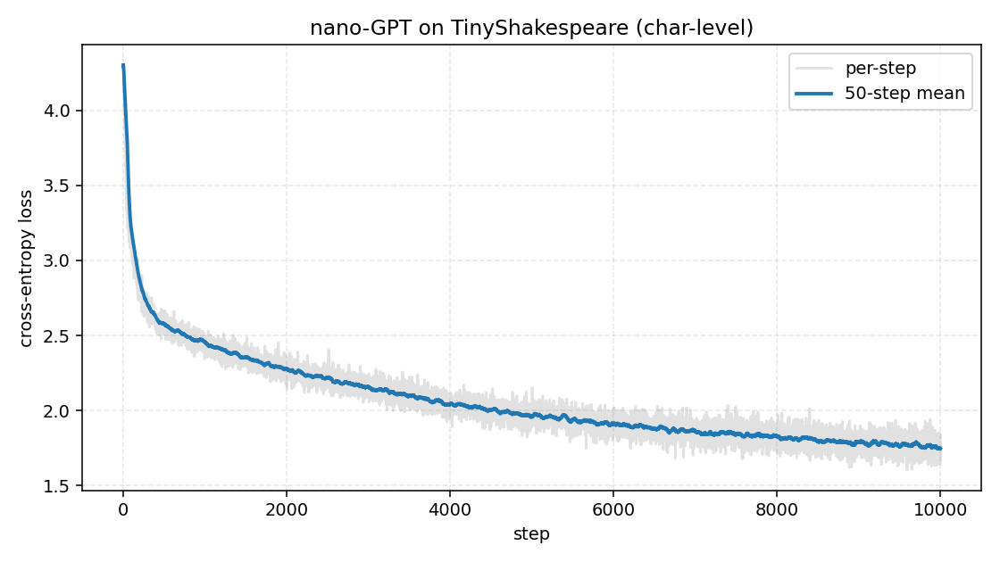

# burn-nano-gpt

Rust 製の深層学習フレームワーク [burn](https://burn.dev/) で
[Karpathy の nano-GPT](https://github.com/karpathy/nanoGPT) を再構築して動かす、
学習・動作確認用のリポジトリ。

## Crates

| Crate                                   | 役割                                                                      |
| --------------------------------------- | ------------------------------------------------------------------------- |
| [`crates/dataset`](crates/dataset/)     | TinyShakespeare のダウンロード & 行単位 `Dataset` 実装                    |
| [`crates/tokenizer`](crates/tokenizer/) | `Tokenizer` trait + char-level 実装                                       |
| [`crates/model`](crates/model/)         | Transformer ブロック・マルチヘッド attention・nano-GPT 本体 + greedy 生成 |
| [`crates/train`](crates/train/)         | バッチサンプラ・LM cross-entropy loss・1 step 学習・CLI binary            |

## 動かし方

```bash
mise install                     # toolchain & dev tools
cargo build -p train --release
./target/release/train           # default: 1000 steps, 学習前後で "Hello" から greedy 生成
```

主な env var:

| 変数                      | デフォルト | 用途                                         |
| ------------------------- | ---------- | -------------------------------------------- |
| `BURN_NANO_GPT_ITERS`     | `1000`     | optimizer step 数                            |
| `BURN_NANO_GPT_LOG_EVERY` | `100`      | ログ出力間隔                                 |
| `BURN_NANO_GPT_PROMPT`    | `"Hello"`  | 生成プロンプト                               |
| `BURN_NANO_GPT_GENERATE`  | `200`      | 生成トークン数                               |
| `BURN_NANO_GPT_LOSS_CSV`  | (未設定)   | 設定すると毎 step の `step,loss` を CSV 出力 |
| `BURN_NANO_GPT_SEED`      | `0`        | バッチサンプリングの RNG seed                |
| `BURN_NANO_GPT_CACHE`     | `.cache`   | コーパスのキャッシュ先                       |

## 学習結果

以下は **2 層 / d_model=64 / d_ff=256 / block=64 / batch=16 / lr=3e-4 (AdamW)**, 10 000 step
を `Autodiff<NdArray<f32>>` (CPU) で回した記録。所要時間は M1 で約 6 分。

### Loss 推移



|  step | per-step loss |
| ----: | ------------: |
|     1 |          4.30 |
|  1000 |          2.42 |
|  2000 |          2.24 |
|  5000 |          1.98 |
|  8000 |          1.75 |
| 10000 |          1.65 |

50-step 移動平均で見ると初期 500 step で 4.3 → 2.6 まで一気に落ち、その後ゆっくり 1.75
付近に向かって減衰している。完全プラトーには届いていないが、char-level entropy の理論下限
(英語 ~1.0 nats) と比べると、この小さなモデルでも妥当な所まで降りている。

プロットの再生成:

```bash
BURN_NANO_GPT_ITERS=10000 BURN_NANO_GPT_LOSS_CSV=docs/loss.csv \
  ./target/release/train
uv run docs/plot_loss.py docs/loss.csv docs/loss_curve.png
```

### 生成結果（学習前 vs 学習後）

同じプロンプト `"Hello"` から greedy decode (argmax) で 240 トークン生成。

**学習前（ランダム初期化）**

```
HelloqlFoswxSyz,.u:VlF:LY3X&WtAHCvc.Iy,o;JF;3AsK&WDplc.ujiYyuj.dkKLyLyLyLy...
```

意味のある文字列にはならず、初期化のクセで 2 文字パターンに吸い込まれて崩壊する。

**学習後（10 000 steps）**

```
Hellow the shall the shall the sould the so the so the shall the sould
the so the seat the so the so the so the so the so the so the so so
the sould the sould the so the sould the sould the so the sould the...
```

- 空白・改行の確率分布を覚え、英単語っぽい区切りで出力するようになった
- `the`, `shall`, `so`, `sould` といった Shakespeare 頻出語 (および word-shaped な綴り誤り)
  が出るようになった
- ただし greedy + 小モデルなので「the ◯◯◯◯◯ the」のループに陥りやすい
  — 温度サンプリングや top-k を入れると多様性は上がるはず

## Backend

主バックエンドは `wgpu` を想定 (`Cargo.toml` で feature 有効化済み) だが、
CPU・決定性・CI 容易性のため、現状の `train` バイナリは `Autodiff<NdArray<f32>>` を使う。
モデル / 学習ループは `Backend` / `AutodiffBackend` に対してジェネリックに書かれているので、
別バックエンドへの差し替えは `type Backend = ...;` を変えるだけで済む。
